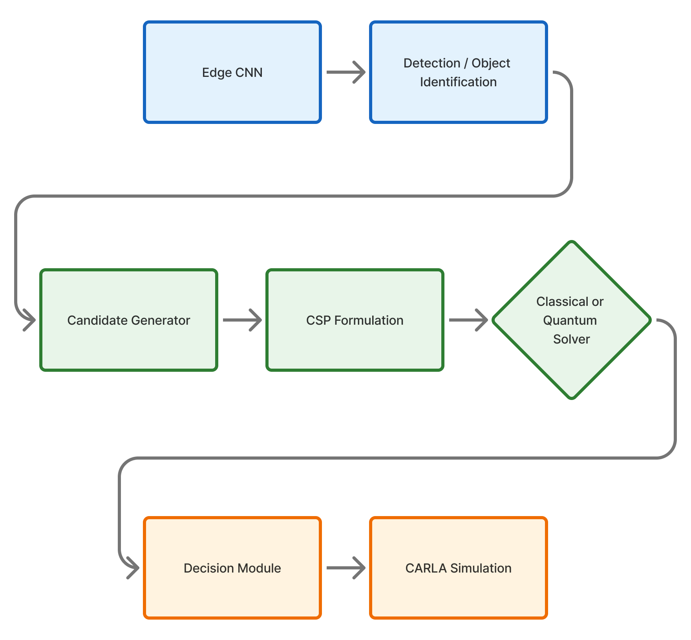

# Quantum-Assisted Decision Making for Autonomous Driving

This repository explores a **hybrid classical–quantum decision-making framework** for autonomous driving, using **Grover’s search algorithm** to select optimal control actions under safety constraints.

The current implementation operates fully in **simulation (CARLA)** and demonstrates how a quantum search primitive can be integrated into a real-time planning loop. Future work will extend this pipeline toward **hardware execution on real quantum processors**.

---

## Overview

Autonomous vehicles must repeatedly choose safe and efficient control actions under uncertainty.  
In this project, decision making is formulated as a **discrete search over candidate acceleration profiles**, where each candidate is evaluated using a physics-based cost function.

Two decision strategies are compared:

- **Classical planner:** brute-force evaluation of all candidate profiles
- **Quantum planner:** Grover-based search over the same candidate set

Both approaches operate on **identical inputs and cost functions**, enabling a fair comparison.

---

## System Architecture

The system is organized into three conceptual layers:

- **Perception Layer:** object detection and state estimation  
- **Decision Layer:** candidate generation, constraint formulation, and classical or quantum solving  
- **Execution Layer:** application of the chosen action in the simulator  

### Architecture Diagram



---

## Candidate-Based Decision Model

At each planning tick, the ego vehicle samples a discrete set of candidate acceleration profiles, for example:

- `keep`
- `comfort_brake`
- `hard_brake`
- `creep`

Each candidate profile is **rolled out over a short planning horizon (~3 s)** and evaluated using a cost function that combines safety, comfort, and performance objectives.

---

## Cost Function

Each candidate trajectory is evaluated using the following structure:

### 1. Hard Safety Constraint

Any candidate that violates the minimum safe distance is rejected:

```python
if dmin < cfg.d_safe:
    return False
```

This guarantees collision avoidance.

### 2. Soft Safety Penalty

Candidates approaching the pedestrian too closely are penalized:

```python
safety_cost = w_safety * (d_soft - dmin)**2
```

This encourages conservative clearance without abrupt braking.

### 3. Comfort and Tracking Terms

Additional penalties discourage aggressive or unstable motion:

- Velocity tracking error  
- Acceleration magnitude  
- Jerk (change in acceleration)  

### Final Cost

```python
J = 5*v_err + 2*a_cost + j_cost + safety_cost
```

The candidate with the **lowest total cost** is selected.

---

## Quantum Decision Module (Grover Search)

The quantum planner encodes candidate actions as computational basis states and applies **Grover’s search algorithm** to amplify the optimal action.

Key properties:

- One Grover iteration for 4 candidates  
- Oracle marks the lowest-cost valid action  
- Measurement yields the selected control action  

The quantum module is executed **online per planning tick**, using a simulator backend.

---

## Results

### Decision Consistency

Across **120 planning snapshots**, the Grover-based solver matched the classical planner’s decision in **100% of cases**:

This confirms the correctness of the quantum encoding and oracle construction.

---

## Scalability Discussion

Theoretical complexity:

- **Classical search:** O(N)  
- **Grover search:** O(√N)  

While the current implementation uses a small candidate set, the framework is designed to scale toward **32–128+ candidates**, where Grover’s quadratic speedup becomes increasingly relevant.

---

## Limitations

- Quantum execution is simulated (no physical quantum hardware yet)  
- CARLA is used for scenario validation only  

---

## Future Work

Planned extensions include:

- Execution on **IBM Quantum hardware via API**  
- Hardware-in-the-loop experiments using a mobile robot platform  
- Larger candidate sets to evaluate scaling behavior  

---

## Tech Stack

- **Simulation:** CARLA  
- **Quantum SDK:** Qiskit  
- **Source Code:** Python  
- **Decision Frequency:** 20 Hz  

---

## Status

🚧 **Active research prototype**  
Simulation complete — hardware implementation planned for next phase.
